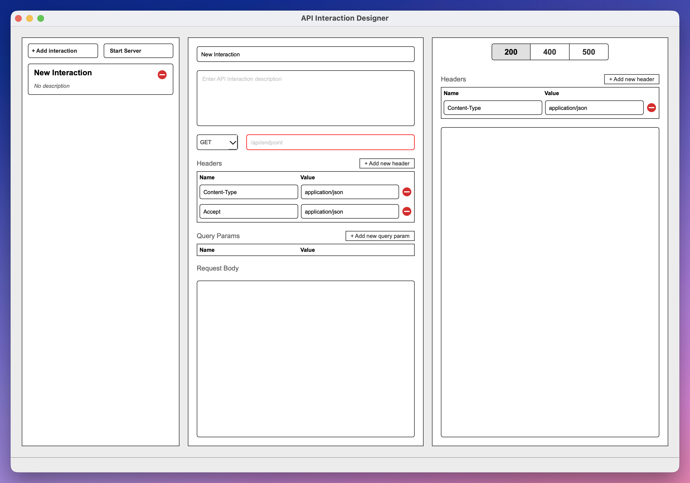

# API SketchPad

API SketchPad is a desktop application (PyQt6) for interactively testing, documenting, and simulating RESTful APIs.



## Project Overview

API SketchPad provides a flexible three-column interface for composing HTTP requests, editing response schemas, and running simulated or live requests. It's optimized for API developers, QA engineers, and technical writers who want a lightweight, local tool for exploring and documenting APIs.

## Key Features

- Three-column layout: Interactions list / Request editor / Response manager
- Free-form request body editor with syntax highlighting (JSON/XML)
- Configurable request/response headers and status codes
- Basic simulated testing mode (configurable network delay)
- In-memory session persistence with export/import

## Prerequisites

- Python 3.12+
- PyQt6 >= 6.4.0

## Installation (dev)

Install a development environment and tools. This project uses `uv` and `make` in the template, but you can install dependencies with pip as well.

```bash
# using the provided helper (if uv is configured)
make install
```

## Run (development)

```bash
# runs the top-level module (preferred)
make run
# or run via uv
uv run python -m api_sketchpad.main
```

## Testing

Run unit tests and linters.

```bash
make test
make check
```

## Project structure

```
api_sketchpad/         # application package (UI, models, controllers)
pyproject.toml         # project metadata and dependencies
Makefile               # helper commands for dev and packaging
README.md              # this file
initial-spec.md        # project requirements / spec
```

## Contributing

1. Keep changes small and well-tested.
2. Add tests for new behavior and ensure linters pass.
3. Use pre-commit hooks before opening a PR.

## License

MIT License
